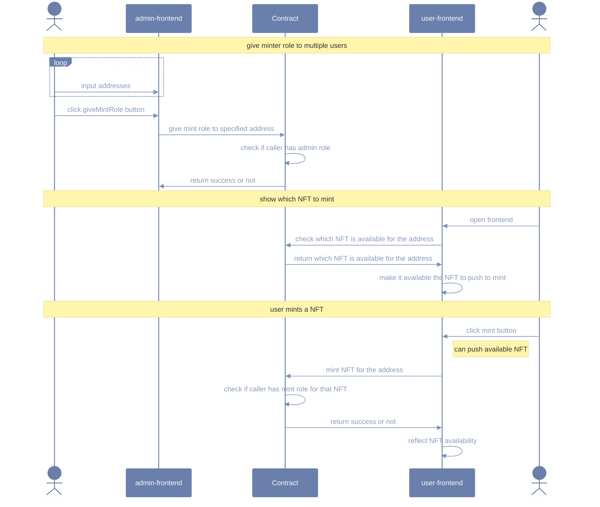

```mermaid
%%{init:{'theme':'base','themeVariables':{'primaryColor':'#6A7FAB','primaryTextColor':'#FAFBF9','primaryBorderColor':'#6A7FAB','lineColor':'#6A7FABCC','textColor':'#6A7FABCC','fontSize':'20px'}}}%%
sequenceDiagram
    actor A as Admin
    participant AF as admin-frontend
    participant C as Contract
    participant UF as user-frontend
    actor U as User
    Note over A,U: give minter role to multiple users
    loop store addresses
        A->>AF: input addresses
    end
    A->>AF: click giveMintRole button
    AF->>C: give mint role to specified address
    C->>C: check if caller has admin role
    C->>AF: return success or not
    Note over A,U: show which NFT to mint
    U->>UF: open frontend
    UF->>C: check which NFT is available for the address
    C->>UF: return which NFT is available for the address
    UF->>UF: make it available the NFT to push to mint
    Note over A,U: user mints a NFT
    U->>UF: click mint button
    Note right of UF: can push available NFT
    UF->>C: mint NFT for the address
    C->>C: check if caller has mint role for that NFT
    C->>UF: return success or not
    UF->>UF: reflect NFT availability
```