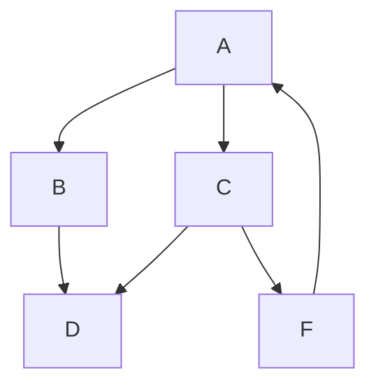
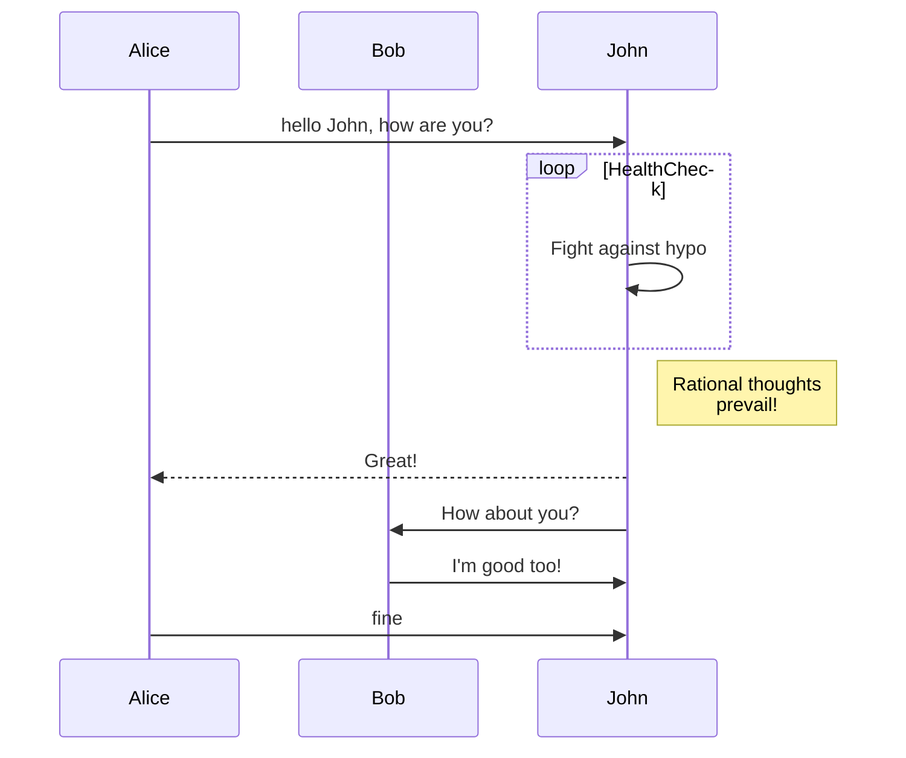
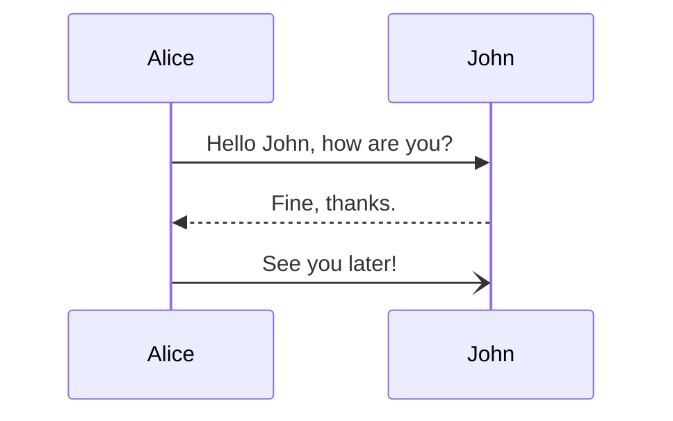
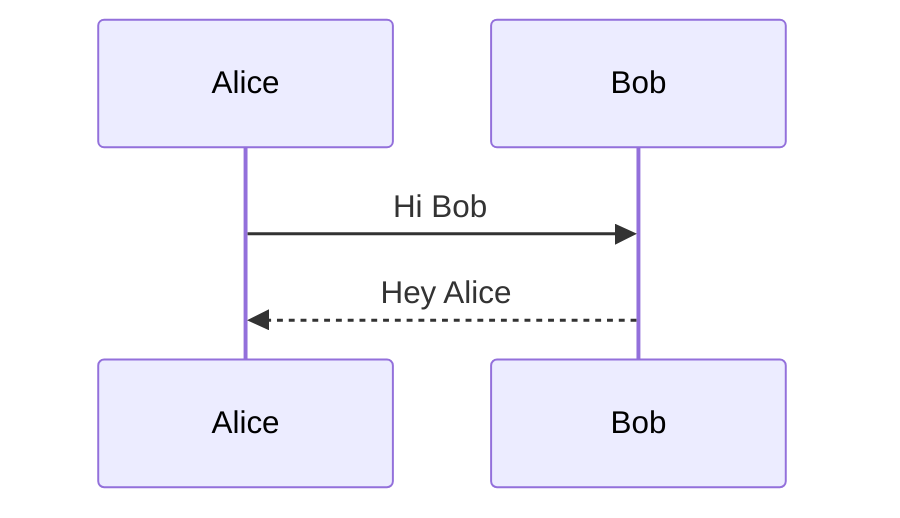
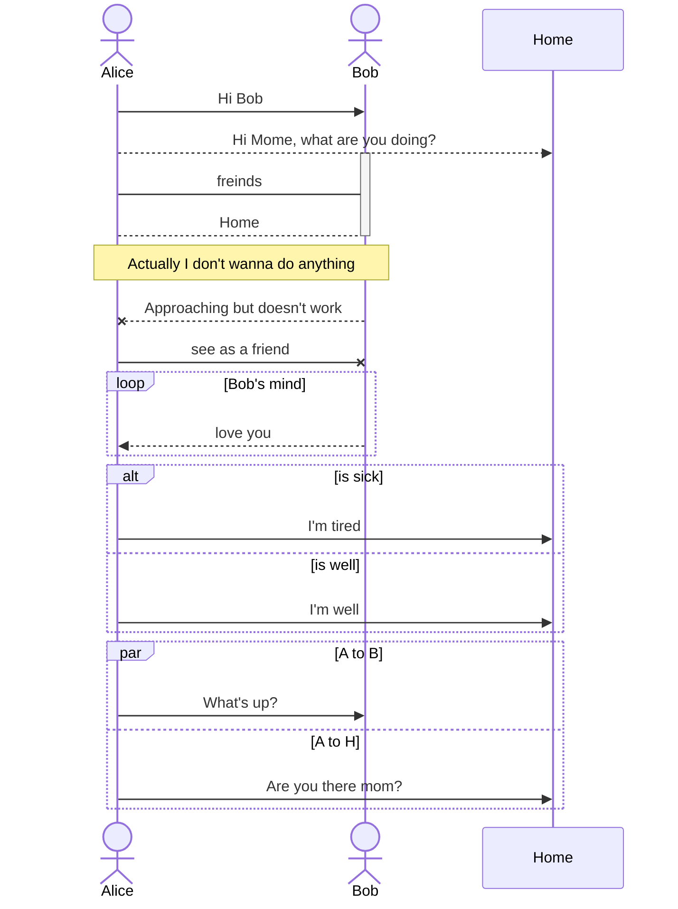

```mermaid
graph TD;
    A-->B;
    A-->C;
    B-->D;
    C-->D;
    C-->F;
    F-->A;
```

```mermaid
sequenceDiagram
    participant Alice
    participant Bob
    Alice ->> John: hello John, how are you?
    loop HealthCheck
        John->>John: Fight against hypo
    end
    Note right of John: Rational thoughts <br/>prevail!
    John-->> Alice: Great!
    John ->> Bob: How about you?
    Bob ->> John: I'm good too!
    Alice->> John:fine
```

```mermaid
sequenceDiagram
    Alice->>John: Hello John, how are you?
    John-->>Alice: Fine, thanks.
    Alice-)John: See you later!
```

```mermaid
sequenceDiagram
    participant Alice
    participant Bob
    Alice->>Bob: Hi Bob
    Bob -->>Alice: Hey Alice
```

```mermaid
sequenceDiagram
    actor A as Alice
    actor B as Bob
    participant H as Home
    A->>B: Hi Bob
    A-->>H: Hi Mome, what are you doing?
    activate B
    B ->A: freinds
    A-->B: Home
    deactivate B
    Note over A,B: Actually I don't wanna do anything
    B --xA: Approaching but doesn't work
    A-xB: see as a friend
    loop Bob's mind
        B-->>A: love you
    end
    alt is sick
        A->>H: I'm tired
    else is well
        A->>H: I'm well
    end
    par A to B
        A->>B: What's up?
    and A to H
        A->>H: Are you there mom?
    end
```